# OmniCorp Multi-Division Search Solution
**Scenario:**
 OmniCorp is a diversified corporation with two major business divisions: Hospitality and Publishing. Each division maintains different types of data in various formats, creating information silos that hinder cross-divisional insights and employee productivity. Your mission is to implement a unified Azure AI Search solution that enables employees across both divisions to search and discover information from:

- **OmniCorp Hospitality**: Hotel database with property details, locations, ratings, and amenities (JSON/SQL format)
- **OmniCorp Publishing**: Book catalog with titles, authors, genres, and metadata (CSV format)

## Instructions
Environment Setup and Resource Deployment

1. Download Azure Sample Datasets:
   Navigate to Azure sample data sources:
   - Hotels data: [Azure Search Sample Data](https://github.com/Azure-Samples/azure-search-sample-data/tree/main/hotelreviews)
       
      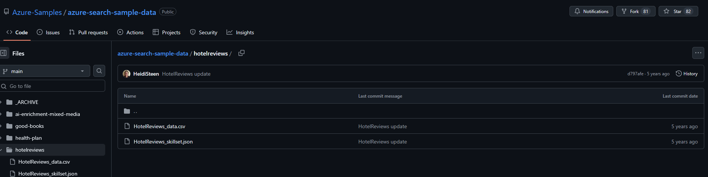
   - Good Books CSV: [Kaggle Books Dataset](https://github.com/Azure-Samples/azure-search-sample-data/tree/main/good-books)
       
      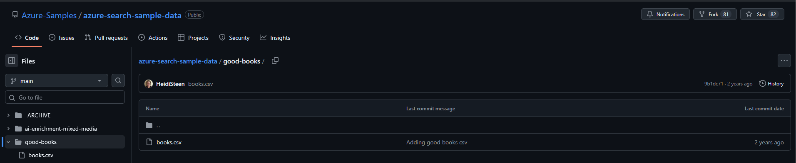

   
2. To Create Azure AI Search Resource access Azure Portal:
   - Navigate to [Azure Portal](https://portal.azure.com)
   - Sign in with your Azure subscription credentials

3. Search `AI Search ` service in the Azure Portal search bar:
   
      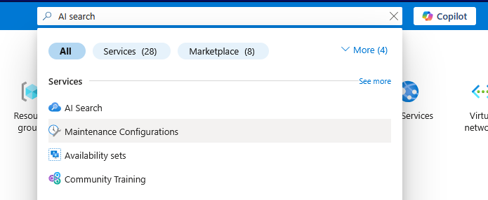
   
4. Click `+ Create` to create a new AI search Service:
   
      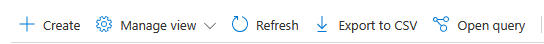

5. Configure with the following settings:
     ```
     Subscription: [Your Azure Subscription]
     Resource Group: [Create new] omnicorp-search-rg
     Service Name: omnicorp-search-[yourname][random]
     Location: East US (or available region)
     Pricing Tier: Standard S1 (required for multiple data sources)
     ```
     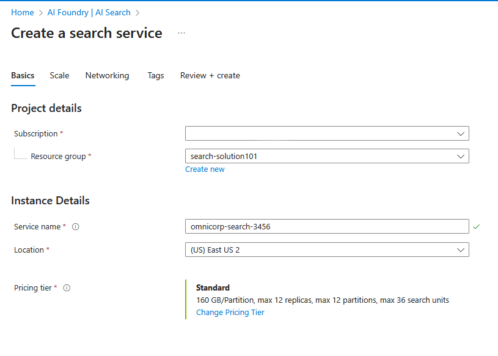

6. Click `Review + create`:
   
     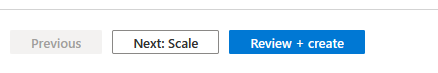

7. Then `Create` to create the service:
   
     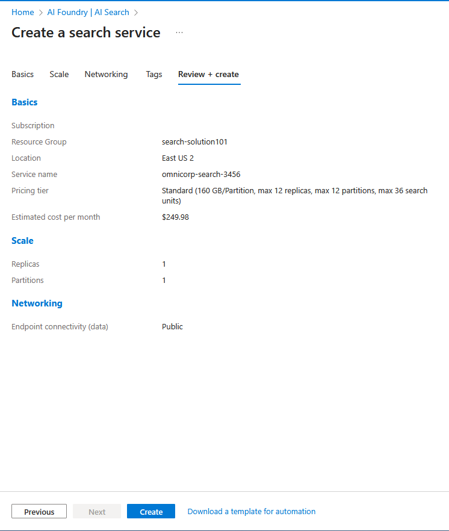


### Create Storage Account 

8. To Create Azure Storage Account, go to Azure Portal and in the Search bar search for `Storage accounts`:
     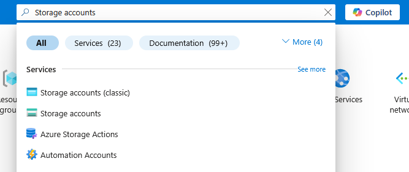

         *Do not select Storage account (Classic)*
9.  Click `+ Create` to create a storage account:
    
      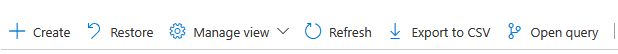

10. Configure it with following settings:
   
   
     ```
     Subscription: [Your Azure Subscription]
     Resource Group: omnicorp-search-rg
     Storage Account Name: omnicorpstorage[yourname][random]
     Primary service: Azure Blob Storage or Azure Data Lake Storage Gen 2
     Region: East US
     Performance: Standard
     Redundency: Locally-redundant storage (LRS)
     ```
     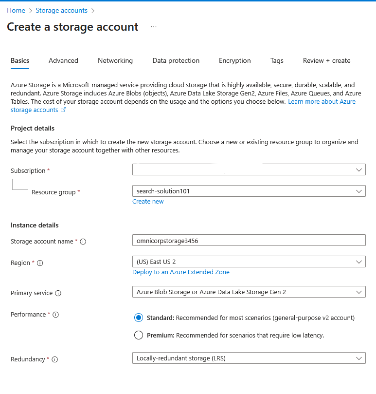

   - On the **Advanced** tab, check **"Allow enabling anonymous access on individual containers"**
      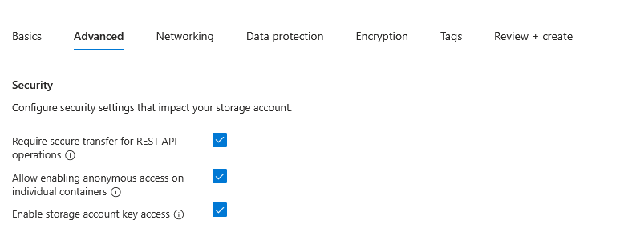

11.  Click `Review + create`:
   
     

12. Then `Create` to create the service:
   
     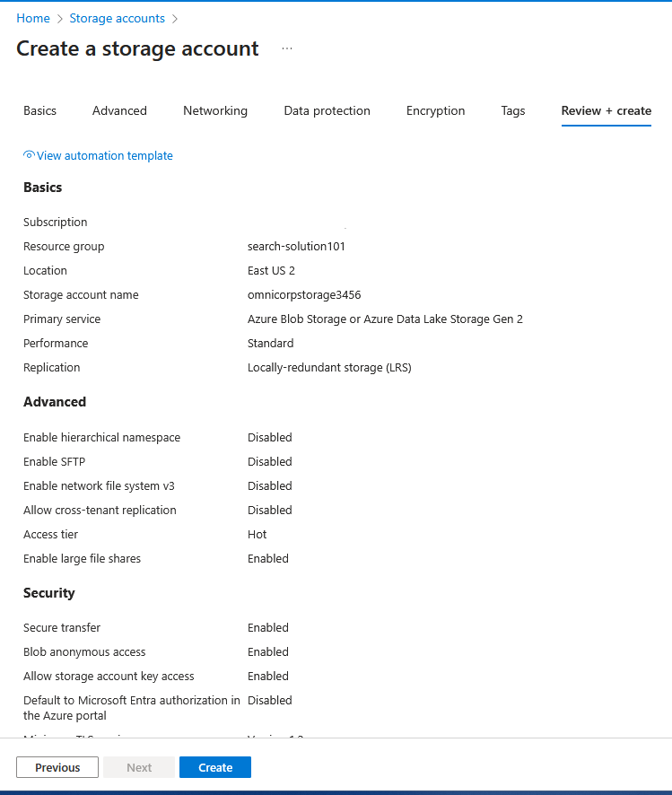


