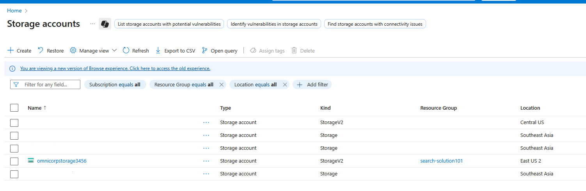
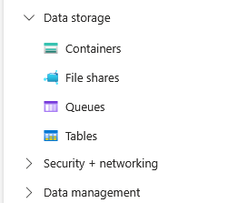
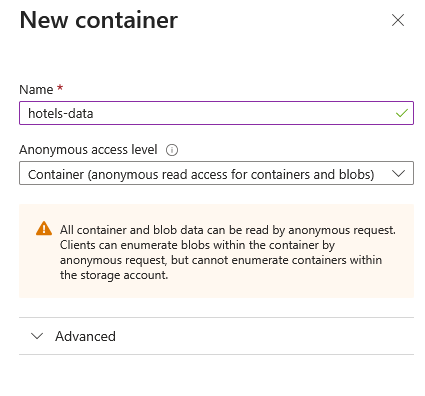
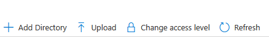
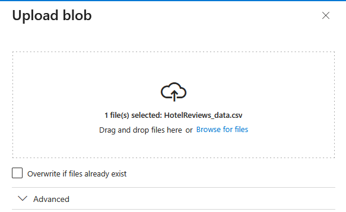
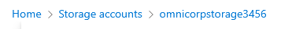
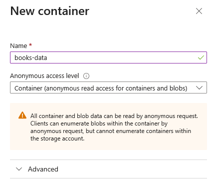
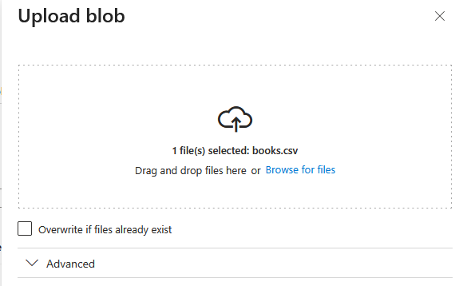
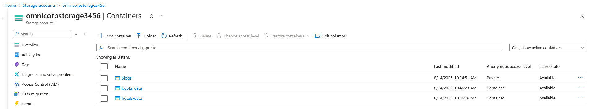

Before Azure AI Search can index and search your data, you need a centralized storage location to host the source datasets. Azure Storage Account serves as the foundation for your multi-division search solution, providing scalable and secure blob storage for CSV files from different business units. In this phase, you'll establish the storage infrastructure that acts as the data source for your search indexes. By organizing data into separate containers, you create logical boundaries between OmniCorp's Hospitality and Publishing divisions while maintaining unified access through Azure AI Search.

## Instructions

1.  Let's create Containers to hold Hotel reviews and book data for the search: Search for the Storage accounts in azure portal and go to newly created Storage account:

    

2.  In the leftside menu under `Data storage` select `Containers`:
   
    

3.  Click `+ Add container` to create the Hotels Container with following data:
   - Name:  `hotels-data`.
   - Set access level to `Container`.
  
     

4.  Upload the Downloaded  `hotels.csv` file from the Azure sample data repository. Click `Upload` :
    
     

5. Browse for the downloaded file or drag and drop the file to upload:
   
     

6. Click `Upload`:
    
     
    
7.  Again go back to storage account to create the `Books-data` container:
   
         *you can use top navigation link to go backward.*

    

8.  In the leftside menu under `Data storage` select `Containers` again to create :
   
      

9.  Click `+ Add container` to create the Hotels Container with following data:
       - Name:  `books-data`.
       - Set access level to `Container`.
   
      

10. Upload the Downloaded  `books.csv` file from the Azure sample data repository.Click `Upload`: 
    
      

11. Browse for the downloaded file or drag and drop the file to upload:
    
      

12. Click `Upload` :

      

13. Once you have completed the above tasks, you're storage containers looks like this.
      