This phase transforms your raw CSV data into powerful, searchable indexes that form the core of OmniCorp's unified search solution. You'll create two specialized search indexes—one for hospitality data and another for publishing data—each optimized for their respective business requirements and query patterns. Azure AI Search indexes are more than just data storage; they're intelligent, structured representations of your content that enable lightning-fast searches, faceted navigation, and complex filtering. By creating separate indexes for each business division, you maintain data integrity while enabling cross-divisional insights and analysis.

## Instructions.
Create Hotels Data Source and Index

1. Navigate to your Azure AI Search resource. Search AI Search in Azure portal:
   
   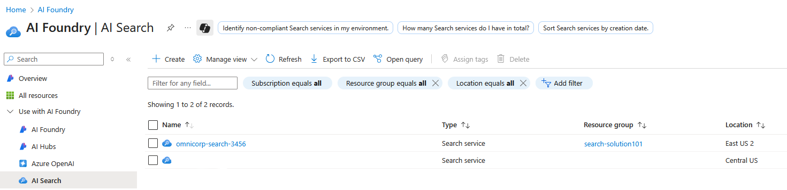

2. Select the `omnicorp-search-3456` Ai Search:
   
   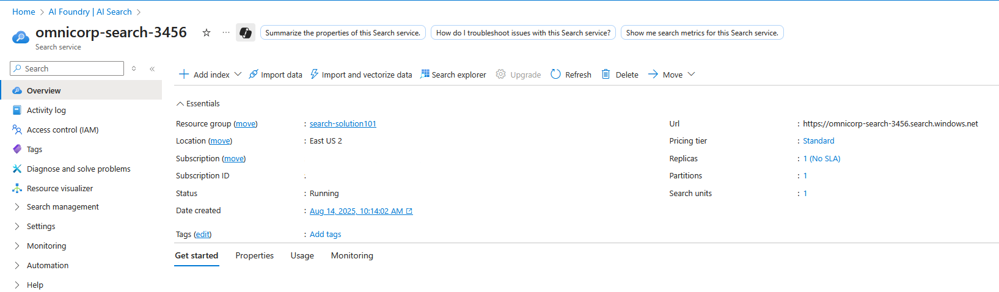

3. Click `Import data` on the Overview page:
   
   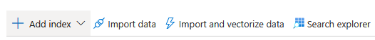

4. Configure Hotel Reviews Data Source:
   
   - Data Source: **Azure Blob Storage**
   - Complete the configuration:
    
     - Data source name: omnicorp-hotels-source
     - Connection string: [Select your storage account → hotels-data container]
     - Parsing mode: Delimited text
     - First line contains headers: Yes
     - Delimiter character: Comma
     - Description: OmniCorp Hospitality hotel reviews and ratings data
     
    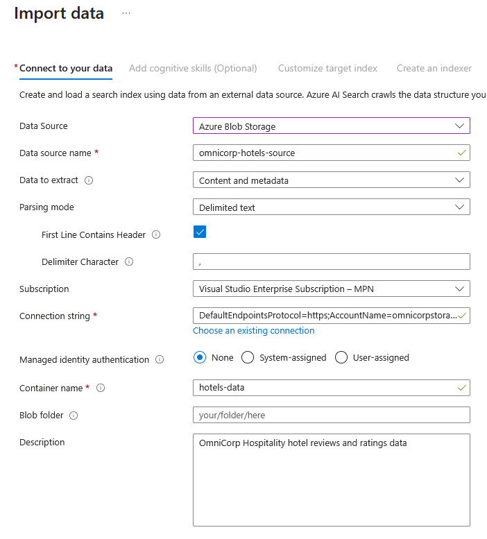
  

5. **Skip Cognitive Skills:**
   - Click **"Skip to: Customize target index"** (no enrichment needed for CSV data)
  
    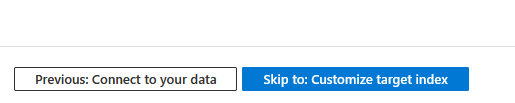

6. Based on the following table Configure **Customize target index**:
   - Index name: **omnicorp-hotels-index**
   - Configure field properties (field names will match the CSV headers):

        *select all fields for initial indexing.*
    
    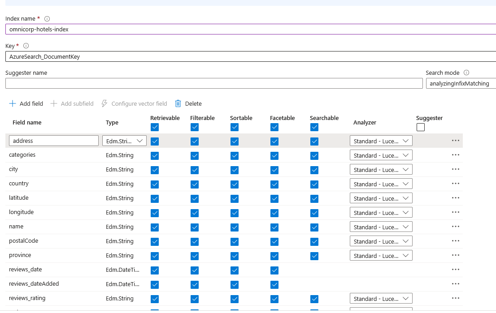

     **Always remember to change the data Type for each columns. Set the Value to Edm.Int32 for the following fields,**

      - reviews_ratings
     

7. **Create Hotel Reviews Indexer**:
   - Indexer name: **omnicorp-hotels-indexer**
   - Schedule: **Once**
   
    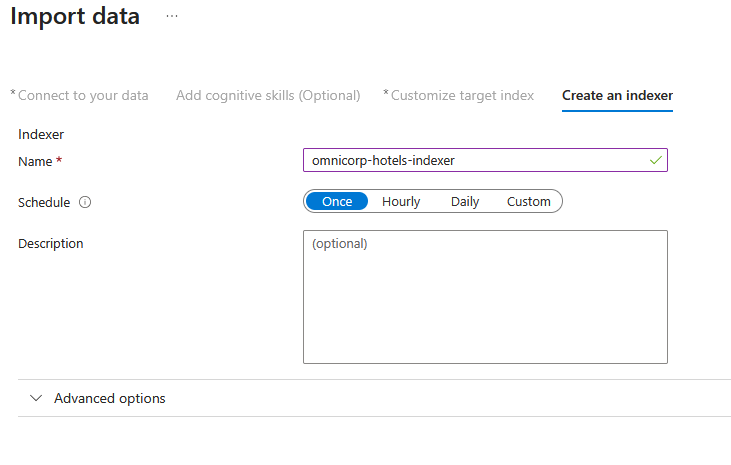

8. Submit and monitor completion:
     
    


###  Create Books Data Source and Index

9. Click `Import data` on the Overview page:
   
   


10. Configure Omnicorp Publication Data Source:
   
   - Data Source: **Azure Blob Storage**
   - Complete the configuration:
    
     - Data source name: omnicorp-books-source
     - Connection string: [Select your storage account → books-data container]
     - Parsing mode: Delimited text
     - First line contains headers: Yes
     - Delimiter character: Comma
     - Description: OmniCorp Publishing book catalog data
     
     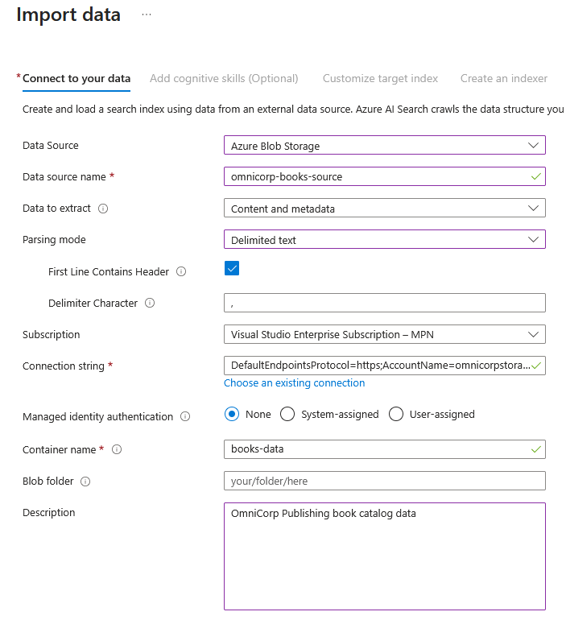
  

1. **Skip Cognitive Skills:**
   - Click **"Skip to: Customize target index"** (no enrichment needed for CSV data)
  
    

2. Based on the following table Configure **Customize target index**:
   - Index name: **omnicorp-books-index**
   - Configure field properties (field names will match the CSV headers):

          select all fields for initial indexing.
    
    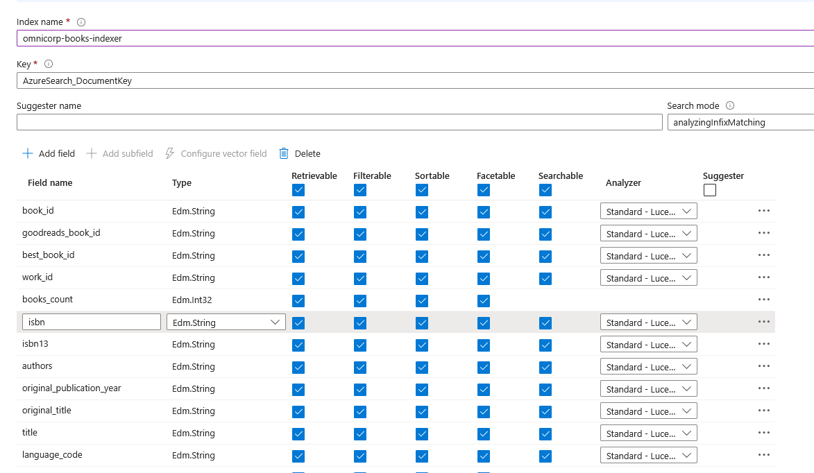
    
  **Always remember to change the data Type for each columns. Set the Value to Edm.Int32 for the following fields,**

      - books_count
      - average_rating
      - rating_count
      - work_rating_count
      - work_text_reviews_count


7. **Create Hotel Reviews Indexer**:
   - Indexer name: **omnicorp-books-indexer**
   - Schedule: **Once**
   
    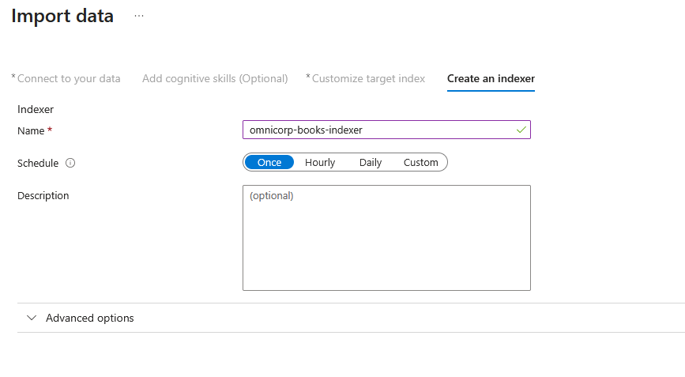

8. Submit and monitor completion:
     
    


## Individual Index Testing

### Step 8: Test Hotel Reviews Search
9. Access Search Explorer.In your Azure AI Search resource, click `Search explorer`:
   
   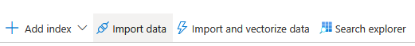

10.  Select **"omnicorp-hotels-index"** from the dropdown:
   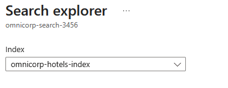

    *change the View to `JSON view` before entering following queries.*

11.  **Execute Hotel Reviews Test Queries**

   **Query 1: All Hotels with Basic Info**
   ```json
    {
    "search": "*",
    "select": "name,city,reviews_rating,categories",
    "top": 10
    }  
   ```

   **Query 2: High-Rated Hotels**
   ```json
   {
     "search": "*",
     "select":  "name,city,reviews_rating,categories",
     "filter": "reviews_rating eq 4",
     "orderby": "reviews_rating desc"
   }
   ```

  **Query 3: Budget Hotels by Location**
   ```json
   {
     "search": "*",
     "filter": "categories eq 'Hotels' and province eq 'GA'",
     "select": "name,city,reviews_rating,categories",
     "orderby": "reviews_rating desc"
   }
   ```

   **Query 4: Hotels with Facets**
   ```json
   {
     "search": "*",
     "facets": ["category", "province", "reviews_rating,interval:1"],
     "top": 5
   }
   ```

   **Note:** Adjust field names in queries based on actual CSV headers (e.g., use lowercase field names if that's how they appear in the CSV).

###  Test Books Search

11. **Switch to Books Index**
   - In Search Explorer, select **"omnicorp-books-index"** from the dropdown
    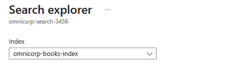
12. **Execute Books Test Queries**

   **Query 1: All Books Overview**
   ```json
   {
     "search": "*",
     "select": "title,authors,average_rating,original_publication_year",
     "top": 10
   }
   ```

   **Query 2: High-Rated Books**
   ```json
   {
     "search": "*",
     "filter": "average_rating gt 4.0",
     "select": "title,authors,average_rating,ratings_count",
     "orderby": "average_rating desc"
   }
   ```

   **Query 3: Search by Author**
   ```json
   {
     "search": "Tolkien",
     "searchFields": "authors",
     "select": "title,authors,average_rating,original_publication_year"
   }
   ```

   **Query 4: Popular Books (High Review Count)**
   ```json
   {
     "search": "*",
     "filter": "ratings_count gt 1000000",
     "select": "title,authors,ratings_count,average_rating",
     "orderby": "ratings_count desc"
   }
   ```

   **Query 5: Books with Faceted Navigation**
   ```json
   {
     "search": "*",
     "facets": ["authors", "average_rating,interval:1", "language_code"],
     "select": "title,authors,average_rating",
     "top": 5
   }
   ```

  
 **Note:** Adjust field names in queries based on actual CSV headers from the Azure sample data.

---
These are some sample queries that you can try on the indexed seearch data. Complex queries, pattern matching and cross divisional Search,Bussiness intelligence queries as well as query performance Analytics can be run based on the requirement.

### Lab Summary

**Congratulations!** You have successfully built a comprehensive multi-division search solution for OmniCorp using Azure AI Search. Throughout this lab, you've gained hands-on experience with:

**✅ Core Azure AI Search Capabilities:**
- Multi-source data integration from CSV files
- Index creation and configuration for different data types
- Advanced query techniques using JSON syntax
- Cross-divisional search analysis and business intelligence

**✅ Real-World Data Management:**
- Working with authentic Azure sample datasets (hotels and books)
- Configuring field mappings and search behaviors
- Implementing faceted navigation and filtering
- Performance monitoring and optimization strategies

**✅ Enterprise Search Patterns:**
- Unified search across diverse business divisions
- Rating and review analysis across different domains
- Geographic and categorical data insights
- Query optimization for production workloads

### Integration with Web Applications

The search foundation you've built can be seamlessly integrated into modern web applications to provide end-users with intuitive search experiences. Here's how your Azure AI Search solution can be extended:
